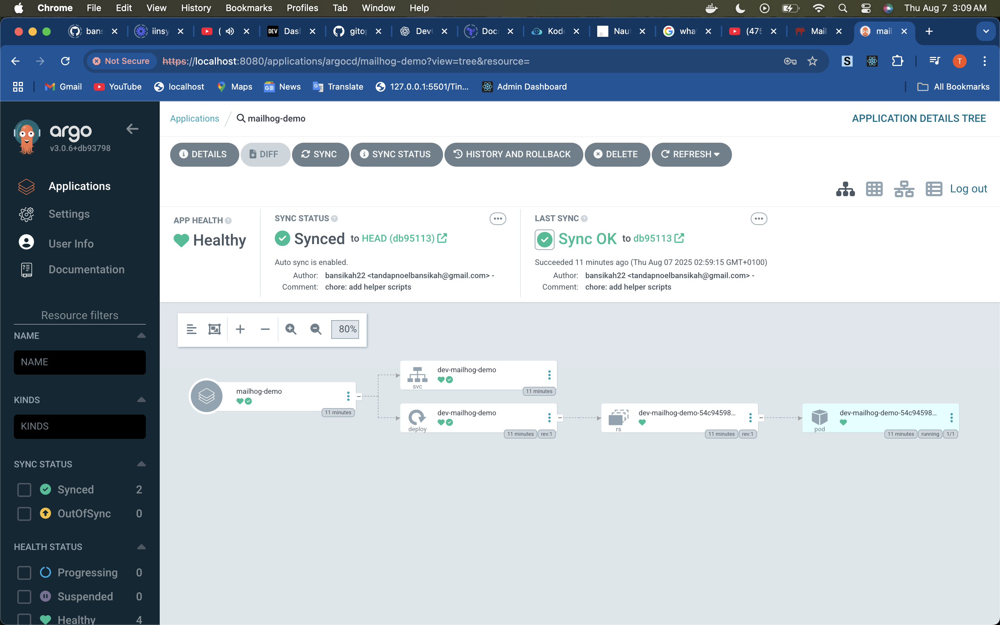

# Table of Contents
- [Project Overview](#gitops-demo-with-terraform-argo-cd-and-kubernetes)
- [Getting Started](#-getting-started)
- [GitHub Setup](#github-setup)
- [Troubleshooting](#troubleshooting)
- [Step-by-Step Usage](#step-by-step-usage)
- [CI/CD & Notifications](#cicd--notifications)
- [Contributing](#-contributing)
- [License](#-license)
- [Verified and Tested](#verified-and-tested)
- [References](#-references)

# GitOps Demo with Terraform, Argo CD, and Kubernetes

[](LICENSE)
[](https://argo-cd.readthedocs.io/en/stable/)
[](https://www.terraform.io/)

A minimal but real-life **GitOps demo** using:
- **Terraform** to provision infrastructure and Argo CD
- **Argo CD** to manage applications in Kubernetes (Minikube)
- **Kubernetes** as the deployment platform

This project demonstrates the GitOps workflow where Git is the **single source of truth** for both infrastructure and applications.

## 🚀 Getting Started

### Prerequisites
- [Minikube](https://minikube.sigs.k8s.io/docs/start/)
- [Terraform](https://developer.hashicorp.com/terraform/downloads)
- [kubectl](https://kubernetes.io/docs/tasks/tools/)
- Git
- GitHub repository (for GitOps workflow)

### GitHub Setup
```bash
# Initialize Git repository (if not already done)
git init
git remote add origin https://github.com/bansikah22/gitops-demo.git

# Push initial code to GitHub
git add .
git commit -m "Initial GitOps demo setup"
git push -u origin master
```

**Note**: ArgoCD needs access to your GitHub repository. Make sure the repository is public or configure SSH keys for private repos.

### Troubleshooting

#### ArgoCD Password
If you need to get the ArgoCD admin password:
```bash
kubectl -n argocd get secret argocd-initial-admin-secret -o jsonpath="{.data.password}" | base64 -d
```

#### Port Forwarding Issues
If you can't access the UIs, restart port forwarding:
```bash
# Kill existing port forwards
pkill -f "kubectl port-forward"

# Restart ArgoCD port forward
kubectl port-forward svc/argocd-server -n argocd 8080:443 &

# Restart MailHog port forward
kubectl port-forward svc/dev-mailhog-demo -n dev 8025:8025 &
```

#### Application Not Syncing
If the application shows "OutOfSync" or "Missing":
```bash
# Check application status
kubectl get applications -n argocd

# Force sync if needed
kubectl patch application mailhog-demo -n argocd --type='merge' -p='{"spec":{"syncPolicy":{"automated":{"prune":true,"selfHeal":true}}}}'
```

## Step-by-Step Usage

_Follow these steps to get your environment up and running quickly. See the detailed instructions in each section above for more info._

1. **Start Minikube**
2. **Install Argo CD with Terraform**
3. **Access Argo CD**
4. **Register App with Argo CD**
5. **Verify Deployment**
6. **Monitor GitOps Workflow**
7. **Test GitOps Workflow**
8. **Access MailHog Web Interface**
9. **Test MailHog SMTP**

## CI/CD & Notifications

This project uses CircleCI for continuous integration and security checks. By default, CircleCI will notify project members of pipeline failures via email, according to each user's notification preferences. You can manage your notification settings in the CircleCI web interface.

## Quick Start

Follow these steps to get started with this GitOps demo:

1. **Clone the repository**
   ```bash
   git clone https://github.com/bansikah22/gitops-demo.git
   cd gitops-demo
   ```
2. **Start Minikube**
   ```bash
   minikube start
   kubectl get nodes
   ```
3. **Provision infrastructure and install Argo CD with Terraform**
   ```bash
   cd infra
   terraform init
   # Install ArgoCD (this creates the initial admin password secret)
   terraform apply -target=helm_release.argocd -auto-approve
   # Retrieve the ArgoCD initial admin password
   export ARGOCD_ADMIN_PASSWORD=$(kubectl -n argocd get secret argocd-initial-admin-secret -o jsonpath="{.data.password}" | base64 -d)
   # Install ArgoCD apps using the password
   terraform apply -var="argocd_admin_password=$ARGOCD_ADMIN_PASSWORD" -auto-approve
   cd ..
   ```
4. **Access Argo CD UI**
   ```bash
   kubectl port-forward svc/argocd-server -n argocd 8080:443 &
   echo "Open ArgoCD UI at: https://localhost:8080"
   echo "Username: admin"
   # Get initial admin password
   kubectl -n argocd get secret argocd-initial-admin-secret -o jsonpath="{.data.password}" | base64 -d && echo
   ```
5. **Register the MailHog application with Argo CD**
   ```bash
   kubectl apply -f apps/mailhog-app.yaml -n argocd
   kubectl create namespace dev --dry-run=client -o yaml | kubectl apply -f -
   ```
6. **Access MailHog UI**
   ```bash
   kubectl port-forward svc/dev-mailhog-demo -n dev 8025:8025 &
   echo "MailHog UI available at: http://localhost:8025"
   ```

For more details, see the [Step-by-Step Usage](#step-by-step-usage) section below.

## 🤝 Contributing
Contributions are welcome! Please open issues and pull requests.

## 📜 License
This project is licensed under the terms of the [MIT License](LICENSE).

## Verified and Tested

This project has been successfully tested and verified with the following components:

###  **Infrastructure**
- ArgoCD deployed and running in Kubernetes
- Terraform configuration validated and working
- All namespaces created (argocd, dev)

###  **Application Deployment**
- MailHog application successfully deployed via GitOps
- Kustomize overlays working correctly (dev/prod)
- Service and deployment resources created

###  **Access Methods**
- ArgoCD UI accessible at https://localhost:8080
- MailHog UI accessible at http://localhost:8025
- Port forwarding working correctly

### **GitOps Workflow**
- Application syncs automatically from GitHub
- Changes pushed to Git trigger automatic deployment
- Monitoring scripts working correctly

## 🔄 GitOps Workflow with GitHub

### Pushing Changes to GitHub
```bash
# Add all changes
git add .

# Commit changes
git commit -m "Update MailHog configuration"

# Push to GitHub
git push origin master
```

### Testing Different Versions
1. **Update MailHog Version**:
   ```bash
   # Edit apps/base/deployment.yaml
   # Change image: mailhog/mailhog:v1.0.1 to mailhog/mailhog:latest
   ```

2. **Update Resource Limits**:
   ```bash
   # Edit apps/overlays/prod/kustomization.yaml
   # Modify CPU/memory limits for production
   ```

3. **Add New Environment**:
   ```bash
   # Create apps/overlays/staging/kustomization.yaml
   # Configure staging-specific settings
   ```

### Monitoring GitOps Sync
```bash
# Watch ArgoCD sync in real-time
kubectl get applications -n argocd -w

# Check sync status
kubectl describe application mailhog-demo -n argocd

# View ArgoCD UI
kubectl port-forward svc/argocd-server -n argocd 8080:443 &
# Open: https://localhost:8080

# Use the monitoring script
./monitor-gitops.sh

# Test different versions
./test-versions.sh

# View detailed documentation
# See docs/ directory for comprehensive guides
```
## 📸 Screenshots

### MailHog Web Interface


### ArgoCD Login


### ArgoCD Dashboard


### MailHog Application in ArgoCD



### MailHog Logs in ArgoCD


## 📚 References
- [Argo CD Documentation](https://argo-cd.readthedocs.io/en/stable/)
- [Terraform Documentation](https://developer.hashicorp.com/terraform/docs)
- [Kustomize](https://kubectl.docs.kubernetes.io/references/kustomize/)
